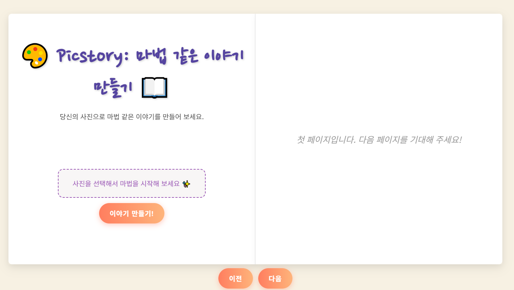
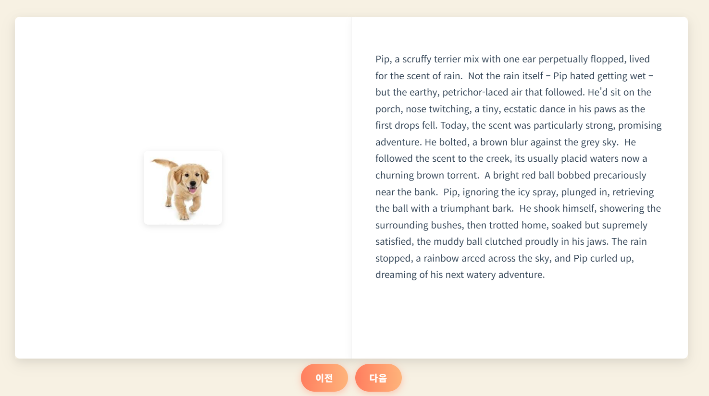

# Project: Picstory

## Picstory 소개

취업 토익, 공무원 영어 시험, 수능 영어 등 저희의 삶에서 영어는 떼어놓을 수 없는 관문이 되어버렸습니다.

이렇게 지겨운 영어. 좀 더 재밌게 공부할 수 있는 방법이 없을까요?

그래서 준비했습니다. 

Picstory, 나만의 사진으로 이야기를 만들어보세요.

## 주요 기능

**메인 페이지**

- 사진을 업로드하여 이야기 만들기를 할 수 있습니다.
- 이야기를 만들 수록 책이 1장씩 늘어나게 됩니다.

**이야기 페이지**

- 왼쪽 장엔 사진이 오른쪽 장엔 만들어진 이야기가 생성됩니다.
- 이전, 다음 버튼을 통해 책을 넘길 수 있습니다.

## 기술스택

sering: flask

model: vgg16 ([tunning 노트 정리](training/training 노트정리))

